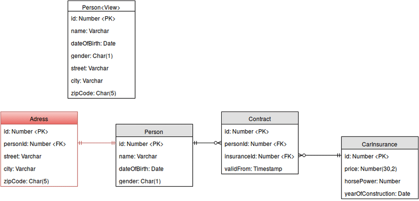

## DBMS
A database management system stores data in such a way that it becomes easier to retrieve, manipulate, and produce information.

#### A modern DBMS has the following characteristics:

- Real-world entity − A modern DBMS is more realistic and uses real-world entities to design its architecture
- Relation-based tables − DBMS allows entities and relations among them to form tables. 
- Isolation of data and application − A database system is entirely different than its data. A database is an active entity, whereas data is said to be passive, on which the database works and organizes. 
- Less redundancy − DBMS follows the rules of normalization, which splits a relation when any of its attributes is having redundancy in values.
- Consistency − Consistency is a state where every relation in a database remains consistent.
- Query Language − DBMS is equipped with query language, which makes it more efficient to retrieve and manipulate data.
- ACID Properties − DBMS follows the concepts of Atomicity, Consistency, Isolation, and Durability
- Multiuser and Concurrent Access − DBMS supports multi-user environment and allows them to access and manipulate data in parallel.
- Multiple views − DBMS offers multiple views for different users. 
- Security −  DBMS offers methods to impose constraints while entering data into the database and retrieving the same at a later stage

## Users
A typical DBMS has users with different rights and permissions who use it for different purposes. Some users retrieve data and some back it up. The users of a DBMS can be broadly categorized as follows :

- Administrators − Administrators maintain the DBMS and are responsible for administrating the database. They are responsible to look after its usage and by whom it should be used. 

- Designers − Designers are the group of people who actually work on the designing part of the database.

- End Users − End users are those who actually reap the benefits of having a DBMS. 

## What is a Schema?
A database schema is the skeleton structure that represents the logical view of the entire database. It defines how the data is organized and how the relations among them are associated. It formulates all the constraints that are to be applied on the data.

A database schema defines its entities and the relationship among them. It contains a descriptive detail of the database, which can be depicted by means of schema diagrams. It’s the database designers who design the schema to help programmers understand the database and make it useful.

## Why do we use them?

a database schema indicates how the entities that make up the database relate to one another, including tables, views, stored procedures, and more. Typically, a database designer creates a database schema to help programmers whose software will interact with the database.

## How do they look like?

## Types of database keys and what are they:
- Primary Key:  Unique & Can’t be have NULL Value/Is the column you choose to maintain uniqueness in a table at row level/ composed of only a single attribute.
.
- Candidate Key.
- Alternate Key.
- Super Key.
- Composite Key: a combination of two or more keys.
- Foreign Key:  It means it has referred to another table. This concept is also know as Referential Integrity.
- Unique Key.

The primary key is used to identify a specific row in a table. The unique key is used to ensure that there is only one entry in a specific table. A foreign key is used to link entries in one table to another. A composite key is a collection of several columns in a table that all together are used to identify a row.

## Relational Database:
A relational database is a collection of data items with pre-defined relationships between them. These items are organized as a set of tables with columns and rows. Tables are used to hold information about the objects to be represented in the database.

#### One-to-one:	
- Both tables can have only one record on each side of the relationship.

- Each primary key value relates to none or only one record in the related table.

- Most one-to-one relationships are forced by business rules and do not flow naturally from the data. Without such a rule, you can typically combine both tables without breaking any normalization rules.

#### One-to-many	
- The primary key table contains only one record that relates to none, one, or many records in the related table.

#### Many-to-many	
- Each record in both tables can relate to none or any number of records in the other table. These relationships require a third table, called an associate or linking table, because relational systems cannot directly accommodate the relationship.