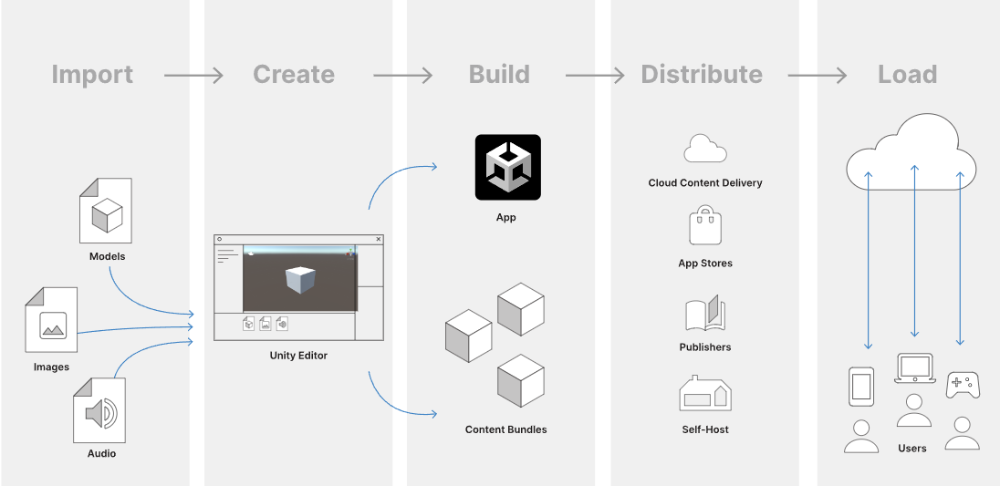

# Unity

Unity, considered to be one of the Best Game Engines, is a popular, powerful, and versatile engine allowing you to create 2D, 3D and multiplayer games across a large number of platforms.

## Unity Interface

The Unity interface consists of: 

- The Toolbar provides access to your Unity Account, Unity Cloud Services, and Unity Collaborate, the play, pause and step controls, and Unity Search, a layer visibility menu, and the Editor layout menu (which provides some alternate layouts for the Editor windows, and allows you to save your own custom layouts).

-  The Hierarchy window is a hierarchical text representation of every GameObjectin the Scene
. Each item in the Scene has an entry in the hierarchy, so the two windows are inherently linked. The hierarchy reveals the structure of how GameObjects attach to each other.

-  The Game view simulates what your final rendered game will look like through your Scene Cameras
. When you click the Play button, the simulation begins.

-  The Scene view allows you to visually navigate and edit your Scene. The Scene view
 can show a 3D or 2D perspective, depending on the type of Project you are working on.

-  Overlays contain the basic tools for manipulating the Scene view and the GameObjects within it. You can also add custom Overlays to improve your workflow.

-  The Inspector Window allows you to view and edit all the properties of the currently selected GameObject. Because different types of GameObjects have different sets of properties, the layout and contents of the Inspector
 window change each time you select a different GameObject.

-  The Project window displays your library of Assets that are available to use in your Project. When you import Assets into your Project, they appear here.

-  The status bar provides notifications about various Unity processes, and quick access to related tools and settings.

## Core concepts you need in order to create gameplay mechanics

1. Scenes
2. GameObjects
3. Prefabs
4. Layers
5. Constraints
6. Rotation and orientation in Unity
7. Lights
8. Cameras
9. Cross-Platform Considerations
10. Publishing Builds
11. Troubleshooting

## Asset Workflow

An asset is any item that you use in your Unity project to create your game or app. Assets can represent visual or audio elements in your project, such as 3D models, textures, sprites
, sound effects, or music. Assets can also represent more abstract items such as color gradients, animation masks, or arbitrary text or numeric data for any use.

An asset might come from a file created outside of Unity, such as a 3D Model, an audio file, or an image. You can also create some types of asset in the Unity Editor, such as a ProBuilder Mesh
, an Animator Controller
, an Audio Mixer, or a Render Texture
.

### The above diagram shows the typical workflow when you work with assets in Unity. Each column represents a separate step and is described below:

- Import assets into the Unity Editor
- Create content using the Unity Editor with those assets.
- Build your app or game file, and optionally its accompanying content bundles
- Distribute the built files so that your users can access them, via a publisher, or an app store
- Load futher updates as neccessary at runtime, depending on your user’s behavior, and how you have grouped and bundled your content.

## Artist workflow benefits
Unity’s asset workflow has tools and features which make it easy to edit and design directly in the Unity Editor:

- Support for many different file formats
- Quick roundtripping between Unity and third-party tools
- Presets to apply custom default settings for types of assets
- Update live content seamlessly using Addressables and Cloud Content Delivery

## Programmer workflow benefits
- A tailored content pipeline (for example, you can write scripts to process assets as Unity imports them, or to control which presets Unity automatically applies based on your own rules).
- Modify source assets through scripting. You can adjust source assets such as materials, meshes or physics through your game code.
- Save memory using the Addressable assets system, which simplifies content management for complex projects, and provides automatic memory management and profiling tools.
- Optimize assets for target platforms. When you’re making a multiplatform project, you might have hundreds of different textures, which all need to be packaged at different resolutions for different platforms. Unity packages, resizes and recompresses your assets automatically when you build to each target platform.

## Workflow considerations
When working with assets in Unity there are different strategies you can use. Which one suits your project depends on factors such as the size of your team, the size of your project, your target platforms, the memory availability on those platforms, and whether you want to release updates, patches, and DLC after publishing it.

If you are working with a large number of assets that you want to publish as separate bundles, you might find it useful to separate some of those groups of assets out into separate projects, so that members of your team don’t need to load a single huge project to work on those bundles.

## Platform considerations
If you keep all your assets in a single project, Unity automatically builds them in the correct format for the current selected platform when you run a build. However, if you split your assets across multiple projects to build your bundles separately, you must make a build for each platform you support. See the Addressables documentation Building for multiple platforms for more information.

The characteristics of a platform also determine the restrictions and possibilities of how you organize your runtime assets. For example, on the standalone platforms (PC or macOS), virtual memory provides a almost unbounded pool of memory, so using the Resources folder or large asset bundles doesn’t typically pose a memory challenge. Conversely, mobile devices and console platforms typically have limited or nonexistent virtual memory, so apps built for those platforms must manage asset loading and unloading more efficiently.

User expectations on a platform are also an important consideration. For example, on mobile platforms, a long initial download and install process can lead to players abandoning your app before they ever play it. For this reason, it’s common for mobile apps to include only a minimal set of assets in the initial build and to download the remaining assets from a remote server the first time the user runs your app.