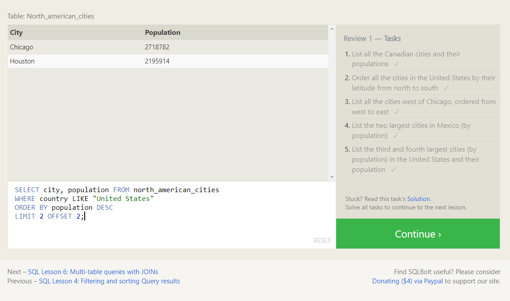

<h1>What is SQL?</h1>
SQL, or Structured Query Language, is a language designed to allow both technical and non-technical users query, manipulate, and transform data from a relational database. And due to its simplicity, SQL databases provide safe and scalable storage for millions of websites and mobile applications.

<h1>Relational databases</h1>
A relational database represents a collection of related (two-dimensional) tables. Each of the tables are similar to an Excel spreadsheet, with a fixed number of named columns (the attributes or properties of the table) and any number of rows of data.

<h1>SELECT queries 101</h1>

The select allows us to filter a specified dataset by coloumn

<h1>WHERE</h1>

This helps us to add a condition to the selected database to check if they meet the required condition

<h1>DISTINCT</h1>

Helps us remove the duplicated rows

<h1>ORDER BY</h1>

helps us sort the data that we have

<h1>LIMIT/OFFSET</h1>

Helps us to create an interval of the data that we want to show

<h1>JOIN/INNER JOIN</h1>
- Using the JOIN clause in a query, we can combine row data across two separate tables using this unique key.
- The INNER JOIN is a process that matches rows from the first table and the second table which have the same key (as defined by the ON constraint) to create a result row with the combined columns from both tables. After the tables are joined, the other clauses we learned previously are then applied.

<h1>INSERTING rows</h1>
we can insert a row to a specified dataset by following the schema for that database

<h1>UPDATE rows</h1>

we can also update a certain row of data in a dataset with this command.

<h1>DELETE rows</h1>

we can also delete a certain row of data in a dataset with this command.

<h1>Creating tables</h1>
The structure of the new table is defined by its table schema, which defines a series of columns. Each column has a name, the type of data allowed in that column, an optional table constraint on values being inserted, and an optional default value.

the table data should follow certain rules or it will throw an error.

<h1>Altering tables</h1>
As your data changes over time, SQL provides a way for you to update your corresponding tables and database schemas by using the ALTER TABLE statement to add, remove, or modify columns and table constraints.
<h1>Dropping tables</h1>

we can remove an entire table with its content by using the drop command

